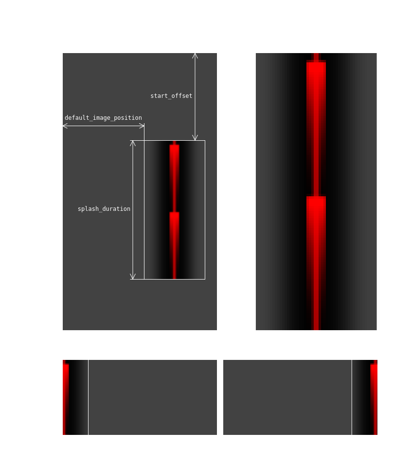

# husarion_ugv_lights

## LED Animations

Basic led configuration is loaded from [`{robot_model}_animations.yaml`](config) file. It includes definition of robot panels, virtual segments and default animations. The default appearance of the animation when looking at the robot is as follows:

|  ID   | NAME              | PRIORITY | ANIMATION                                          |
| :---: | ----------------- | :------: | -------------------------------------------------- |
|   0   | E_STOP            |    3     |                         |
|   1   | READY             |    3     |                          |
|   2   | ERROR             |    0     |                          |
|   3   | NO_ERROR          |    0     |                       |
|   4   | MANUAL_ACTION     |    3     |          |
|   5   | LOW_BATTERY       |    2     |              |
|   6   | CRITICAL_BATTERY  |    2     |    |
|   7   | CHARGING_BATTERY  |    2     |    |
|   8   | BATTERY_CHARGED   |    2     |     |
|   9   | CHARGER_INSERTED  |    1     |    |
|  10   | BATTERY_NOMINAL   |    2     |                |
|  11   | AUTONOMOUS_READY  |    3     |    |
|  12   | AUTONOMOUS_ACTION |    3     |  |
|  13   | GOAL_ACHIEVED     |    1     |          |
|  14   | BLINKER_LEFT      |    1     |            |
|  15   | BLINKER_RIGHT     |    1     |          |

The animations work on multiple layers (priorities) and can blend with each other. On a given layer, there can be only one animation at a time. Animations with a lower priority cover those with higher priority, while respecting transparency.

Here are some examples of blended animations:

| STATE                       | ANIMATION                              |
| -------------------------------- | ---------------------------------- |
| E_STOP + CHARGING_BATTERY at 25% |  |
| E_STOP + CHARGING_BATTERY at 50% |  |
| E_STOP + CHARGING_BATTERY at 75% |  |
| READY + CHARGING_BATTERY at 50%  |    |

### Panels

The `panels` section of the YAML file lists all the physical LED panels on the robot. Each panel has two attributes:

- `channel` [*int*, default: **None**] the identifier for the LED panel. It is used to differentiate between multiple panels.
- `number_of_leds`: defines the total number of LEDs present on the panel.

### Segments

The `segments` section is used to create virtual segments on the robot by dividing the LED panels into different parts. This allows for more precise control over which LEDs are lit up for different effects or indicators. Each segment has three attributes:

- `name`: the identifier for the segment, such as "front" or "rear". It is used to differentiate between multiple segments.
- `channel`: This specifies which LED panel the segment belongs to. It has to match one of the channels defined in the `panels` section.
- `led_range`: This defines the range of LEDs within the panel that the segment covers. The range is specified as a start-end pair (e.g. 0-45). The range can be specified in reverse order (e.g. 45-0), which may be useful for wiring or orientation reasons.

> [!IMPORTANT]
> Each LED in a panel can only belong to one segment. If multiple segments are defined with overlapping `led_range` values on the same panel, only the first occurrence of each LED will be considered.

### Segments map

The `segments_map` section allows creating named groups of segments on which animations can be displayed. Each entry under `segments_map` consists of a key representing the group name and a list of segments included in the group. Segment names have to match one of the segments defined in the `segments` section. By default, you can use provided mapping:

- `all` [*list*, default: **None**]: Grouping both `front` and `rear` segments together.
- `front` [*list*, default: **None**]: Containing only the `front` segment.
- `rear` [*list*, default: **None**]: Containing only the `rear` segment.

### Animations

The `led_animations` section contains a list with definitions for various animations that can be displayed on the LED segments. Supported keys are:

- `animations` [*list*, default: **None**]: definition of animation for each Bumper Lights. Supported keys are:
  - `type` [*string*, default **None**]: Specifies the type of animation. Default animation types are: `husarion_ugv_lights::ImageAnimation`, `husarion_ugv_lights::MovingImageAnimation`.
  - `segments` [*string*, default **None**]: Indicates which segment mapping this particular animation applies to (e.g., all, front, rear).
  - `animation` [*yaml*, default: **None**]: An animation to be displayed on segments. The keys for the configuration of different animation types are explained in detail under the [**Animation Types**](#animation-types) section.
- `id` [*int*, default: **None**]: unique ID of an animation.
- `name` [*string*, default: **ANIMATION_`ID`**]: name of an animation. If not provided, it will default to **ANIMATION\_`ID`**, where `ID` is equal to `id` parameter of the given animation.
- `priority` [*int*, default: **3**]: defines at what layer animation will be assigned. Animations with higher priority (0 corresponds to the highest) will be on top of animations with lower priority. Priorities are defined as follow:
  - **0 - ERROR** highest priority designed to signal critical errors in the system.
  - **1 - ALERT** dedicated to display one-time events e.g. goal reached etc.
  - **2 - INFO** dedicated to display simple information such as battery states.
  - **3 - STATE** lowest priority designed for indicating robot state.
- `timeout` [*float*, default: **120.0**]: time in **[s]**, after which animation will be removed from the queue.

### Animation Types

#### Animation

Basic animation definition. Keys are inherited from the basic **Animation** class by all animations. Supported keys are:

- `duration` [*float*, default: **None**]: duration of the animation.
- `repeat` [*int*, default: **1**]: number of times the animation will be repeated.

> [!NOTE]
> Overall display duration of an animation is a product of a single image duration and repeat count. The result of `duration` x `repeat` can't exceed 10 **[s]**. If animation fails to fulfill the requirement, it will result in an error.

#### ImageAnimation

Animation of type `husarion_ugv_lights::ImageAnimation`, returns frames to display based on a supplied image. Extends `Animation` with keys:

- `image` [*string*, default: **None**]: path to an image file. Only global paths are valid. Allows using `$(find ros_package)` syntax.
- `color` [*int*, default: **None**]: The image is turned into grayscale, and then the color is applied with brightness from the gray image. Values have to be in HEX format. This parameter is not required.

#### MovingImageAnimation

Animation of type `husarion_ugv_lights::MovingImageAnimation`, returns frames to display based on a supplied image, that can be shifted using `param` value. `param` accepts values between `0.0` and `1.0`. Extends `Animation` with keys:

- `image` [*string*, default: **None**]: path to an image file. Only global paths are valid. Allows using `$(find ros_package)` syntax.
- `color` [*int*, default: **None**]: The image is turned into grayscale, and then the color is applied with brightness from the gray image. Values have to be in HEX format. This parameter is not required.
- `center_offset` [*int*, default: **0**]: distance [in px] from the left edge of the provided image to the start of the always visible part of the image.
- `start_offset` [*float*, default: **0.0**]: time [in s] from the beginning of the animation to first row of pixels of the provided image being displayed.
- `object_width` [*int*, default: **0**]: width [in px] of the part of the image that for any `param` will always be visible.
- `splash_duration` [*float*, default: **None**]: duration [in s] of the provided image. If left unset will play one row of pixels per controller tick.
- `default_image_position` [*float*, default: **None**]: sets the default value of the `param`, making it optional.
- `image_mirrored` [*bool*, default: **false**]: mirrors the provided image horizontally.
- `position_mirrored` [*bool*, default: **false**]: switches the position of 0.0 and 1.0 values of the param.

<picture>
  <source media="(prefers-color-scheme: dark)" srcSet=".docs/MovingImageAnimation.png" />
  <source media="(prefers-color-scheme: light)" srcSet=".docs/MovingImageAnimationLight.png" />
  
</picture>

### Defining Animations

Users can define their own LED animations using basic animation types. Similar to basic ones, user animations are parsed using YAML file and loaded on node start. For `ImageAnimation` you can use basic images from the `animations` folder and change their color with the `color` key ([see ImageAnimation](#imageanimation)). Follow the example below to add custom animations.

Create a YAML file with an animation description list. Example file:

```yaml
# my_awesome_user_animations.yaml
user_animations:
  # animation with default image and custom color
  - id: 21
    name: ANIMATION_1
    priority: 2
    animations:
      - type: husarion_ugv_lights::ImageAnimation
        segments: all
        animation:
          image: $(find husarion_ugv_lights)/animations/panther/estop_front.png
          duration: 2
          repeat: 2
          color: 0xffff00

  # animation with custom image
  - id: 22
    name: ANIMATION_2
    priority: 3
    animations:
      - type: husarion_ugv_lights::ImageAnimation
        segments: all
        animation:
          image: /animations/custom_image.png
          duration: 3
          repeat: 1

  # animation with a custom image from custom ROS package
  - id: 23
    name: ANIMATION_3
    priority: 3
    animations:
      - type: husarion_ugv_lights::ImageAnimation
        segments: all
        animation:
          image: $(find custom_pkg)/animations/custom_image.png
          duration: 3
          repeat: 1

  # different animations for Front and Rear Bumper Light
  - id: 24
    name: ANIMATION_4
    priority: 3
    animations:
      - type: husarion_ugv_lights::ImageAnimation
        segments: front
        animation:
          image: $(find custom_pkg)/animations/front_custom_image.png
          duration: 2
          repeat: 2
      - type: husarion_ugv_lights::ImageAnimation
        segments: rear
        animation:
          image: $(find custom_pkg)/animations/rear_custom_image.png
          duration: 3
          repeat: 1
```

> [!IMPORTANT]
>
> - ID numbers from 0 to 19 are reserved for system animations.
> - Priority **0** is reserved for crucial system animations. Users can only define animations with priority **1-3**.

Remember to modify launch command to use user animations:

```bash
ros2 launch husarion_ugv_bringup bringup.launch user_animations_file:=/my_awesome_user_animations.yaml
```

Test new animations:

```bash
ros2 service call /lights/set_animation husarion_ugv_msgs/srv/SetLEDAnimation "{animation: {id: 0, param: ''}, repeating: true}"
```

## Defining a Custom Animation Type

It is possible to define your own animation type with expected, new behavior. For more information, see: [**Animation API**](LIGHTS_API.md).
